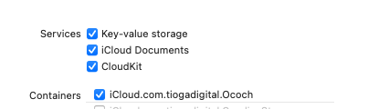

# Ococh - one cuts, other chooses

an app to study Share Extensions and their behvior with iCloud.

How does a share extension work with NSPersistentCloudKitContainer?

The extension only "sees" three kinds of chosen shares, a text, a URL, or a PDF file.
The iCloud container only holds items of type Bookmark for simplcity sake.

Some magic in the `Ococh.entitlements` file is important to get any of it running.

Filter by `KKYY` in the output of the log to see events generated from the code.

the required boxes clicks in the Signing & Capabilities.

Making sure the icloud contain hes the same clicks in both the main app AND the app share extension. (Otherwise, maybe it no works)
